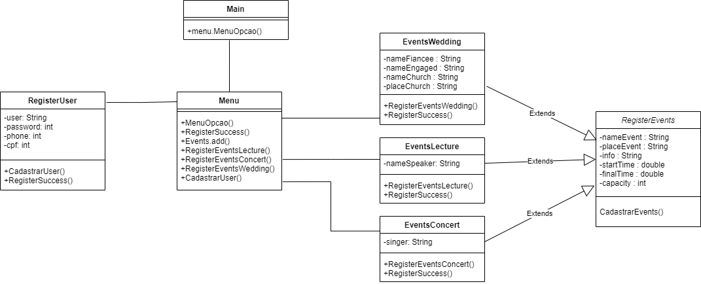
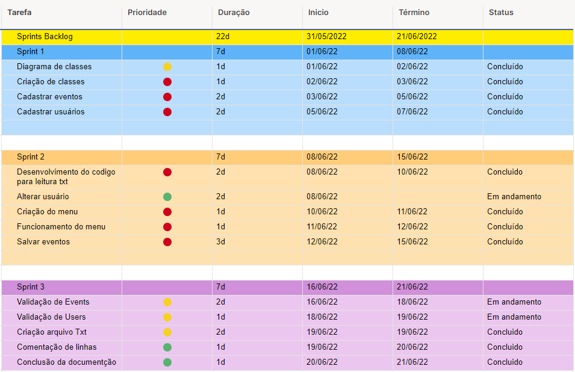

# Events

Sistema de Eventos
- O projeto deve ser desenvolvido em Console;
- Deve implementar um sistema de cadastro e notificação de eventos que estejam ocorrendo em Porto Alegre;
- O sistema deve prover um espaço para cadastro do usuário. Você deve definir os atributos do usuário, que devem ser no mínimo 3 (quanto mais completo, melhor);
- Deve ser possível cadastrar eventos, definindo um horário (dentre outros atributos). Estes eventos devem ter, obrigatoriamente, os atributos: nome, endereço, categoria, horário e descrição;
- Você deve delimitar as categorias para criação de eventos;
- Deve ser possível consultar os eventos cadastrados e decidir participar de qualquer um que esteja listado;
- Da mesma forma, deve ser possível visualizar os eventos em que a presença do usuário foi confirmada e possível cancelar a participação;
- Através do horário, o programa deve ordenar os eventos mais próximos e informar se um evento está ocorrendo no momento (é desejável utilizar a estrutura DateTime para o controle de horários);
- O sistema também deve informar os eventos que já ocorreram;
- As informações dos eventos devem ser salvas em um arquivo de texto chamado events.data. Toda vez que o programa for aberto, deve carregar os eventos a partir da leitura deste arquivo;
- Na estrutura de software do projeto deve constar no mínimo uma classe abstrata e no mínimo 2 métodos virtuais (não necessariamente juntos);

# Diagram de classe - UML

# Sprint

